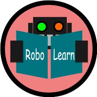
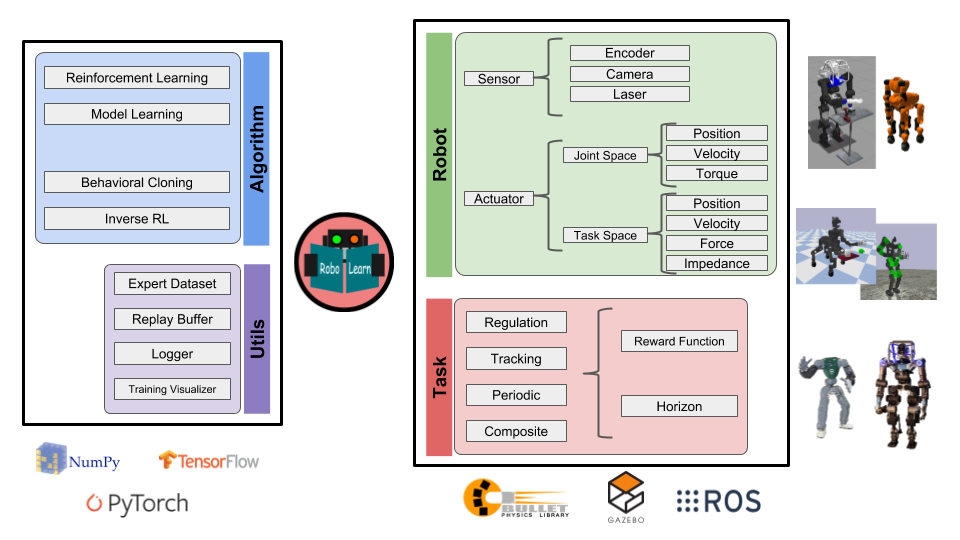

# RoboLearn
"A *Python* package for Robot Learning"

<p align="center">

</p>

**Robolearn** is a python package, mainly focused on learning control, that defines common interfaces
between robot learning algorithms and real/simulated robots.

**This package is ongoing**, so this version is still in development. Sorry for any inconvenience.




# Installation

```bash
git clone https://github.com/domingoesteban/robolearn
cd robolearn
pip install -e .
```

# Citation
If you use this code or it gave you some ideas or it was useful for something else for your research,
I would appreciate that you can cite:

    @misc{robolearn,
      author = {Esteban, Domingo},
      title = {RoboLearn},
      year = {2018},
      publisher = {GitHub},
      journal = {GitHub repository},
      howpublished = {\url{https://github.com/domingoesteban/robolearn}},
    }

<!--
# Acknowledgements
- Vitchyr Pong for rlkit repository ([rlkit repository](https://github.com/vitchyr/rlkit)). Some algorithms are based (or almost the same) the ones in rlkit. Many functionalities of robolearn use code from rlkit.
- Tuomas Haarnoja for softqlearning repository ([softqlearning repository](https://github.com/haarnoja/softqlearning)). SoftQLearning is based in this TensorFlow implementation.
-->
